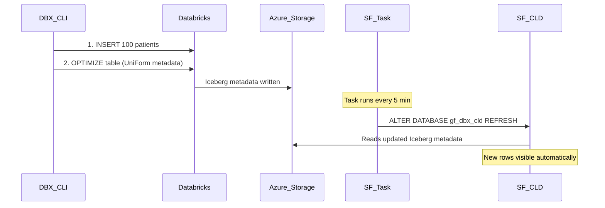

# Plan: CLD Auto-Refresh Test with Databricks INSERT

## Context
Catalog-Linked Databases (CLDs) auto-refresh at Snowflake's internal cadence (typically a few minutes), but there is no user-configurable refresh interval parameter. To get **guaranteed periodic refresh**, we create a Snowflake Task that runs `ALTER DATABASE gf_dbx_cld REFRESH` on a schedule.

## Flow



## Steps

### Step 1: Create a Snowflake Task for auto-refresh
```sql
CREATE OR REPLACE TASK ICEBERG_POC.TESTS.CLD_AUTO_REFRESH
  WAREHOUSE = COMPUTE_WH
  SCHEDULE = '5 MINUTE'
AS
  ALTER DATABASE gf_dbx_cld REFRESH;

ALTER TASK ICEBERG_POC.TESTS.CLD_AUTO_REFRESH RESUME;
```
This refreshes the CLD every 5 minutes automatically.

### Step 2: Get baseline count from both sides
- Databricks: `SELECT COUNT(*) FROM gf_dbx.uniform.patients` (expect 8)
- Snowflake: `SELECT COUNT(*) FROM gf_dbx_cld.uniform.patients` (expect 8)

### Step 3: Insert 100 synthetic patients via Databricks CLI
Execute via `/opt/homebrew/bin/databricks api post /api/2.0/sql/statements` using warehouse `dfd01aaf3ed4195b`:

```sql
INSERT INTO gf_dbx.uniform.patients
SELECT
  1000 + id AS patient_id,
  CASE id % 10
    WHEN 0 THEN 'Ana' WHEN 1 THEN 'Ben' WHEN 2 THEN 'Clara'
    WHEN 3 THEN 'David' WHEN 4 THEN 'Eva' WHEN 5 THEN 'Frank'
    WHEN 6 THEN 'Grace' WHEN 7 THEN 'Hector' WHEN 8 THEN 'Iris'
    ELSE 'Jake'
  END AS first_name,
  CASE id % 8
    WHEN 0 THEN 'Smith' WHEN 1 THEN 'Lee' WHEN 2 THEN 'Patel'
    WHEN 3 THEN 'Garcia' WHEN 4 THEN 'Chen' WHEN 5 THEN 'Kim'
    WHEN 6 THEN 'Brown' ELSE 'Wilson'
  END AS last_name,
  DATE_ADD('1950-01-01', id * 100) AS date_of_birth,
  CASE WHEN id % 2 = 0 THEN 'M' ELSE 'F' END AS gender,
  CASE id % 4 WHEN 0 THEN 'O+' WHEN 1 THEN 'A-' WHEN 2 THEN 'B+' ELSE 'AB+' END AS blood_type,
  CONCAT('555-', LPAD(CAST(1000 + id AS STRING), 4, '0')) AS primary_phone,
  CASE id % 5
    WHEN 0 THEN 'Phoenix' WHEN 1 THEN 'Denver' WHEN 2 THEN 'Seattle'
    WHEN 3 THEN 'Austin' ELSE 'Chicago'
  END AS city,
  CASE id % 5
    WHEN 0 THEN 'AZ' WHEN 1 THEN 'CO' WHEN 2 THEN 'WA'
    WHEN 3 THEN 'TX' ELSE 'IL'
  END AS state,
  CASE id % 4
    WHEN 0 THEN 'Blue Cross PPO' WHEN 1 THEN 'Aetna HMO'
    WHEN 2 THEN 'United Healthcare' ELSE 'Cigna EPO'
  END AS insurance_plan
FROM (SELECT EXPLODE(SEQUENCE(1, 100)) AS id)
```

### Step 4: OPTIMIZE in Databricks
```sql
OPTIMIZE gf_dbx.uniform.patients
```
Required for Delta UniForm to regenerate the Iceberg metadata snapshot.

### Step 5: Verify in Databricks
```sql
SELECT COUNT(*) FROM gf_dbx.uniform.patients
```
Expected: **108 rows**

### Step 6: Wait for auto-refresh and verify in Snowflake
Wait up to 5 minutes for the task to fire, then:
```sql
SELECT COUNT(*) FROM gf_dbx_cld.uniform.patients;
SELECT * FROM gf_dbx_cld.uniform.patients WHERE patient_id >= 1000 ORDER BY patient_id LIMIT 10;
```
Expected: **108 rows** with new patient records visible.

### Step 7: Verify task execution history
```sql
SELECT name, state, scheduled_time, completed_time, error_message
FROM TABLE(INFORMATION_SCHEMA.TASK_HISTORY(TASK_NAME => 'CLD_AUTO_REFRESH'))
ORDER BY scheduled_time DESC
LIMIT 5;
```

### Optional: Suspend task after testing
```sql
ALTER TASK ICEBERG_POC.TESTS.CLD_AUTO_REFRESH SUSPEND;
```
