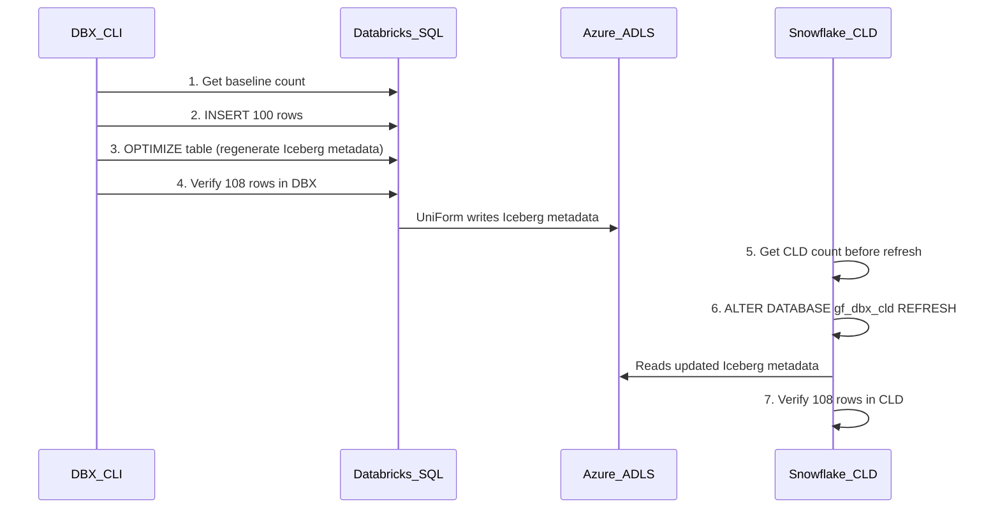

# Plan: CLD Refresh Validation via Databricks CLI

## Goal
Insert 100 records into `gf_dbx.uniform.patients` using the Databricks SQL API (via CLI), then verify the data propagates to `gf_dbx_cld.uniform.patients` in Snowflake.

## Current State
- **DBX CLI**: `/opt/homebrew/bin/databricks` v0.294.0, configured for `adb-2584487012733217.17.azuredatabricks.net`
- **SQL Warehouse**: `dfd01aaf3ed4195b` (Serverless Starter, currently STOPPED -- will auto-start)
- **Table**: `gf_dbx.uniform.patients` — 10 columns, currently **8 rows**
- **CLD**: `gf_dbx_cld.uniform.patients` in Snowflake

## Flow



## Steps

### Step 1: Baseline count in Databricks
```bash
/opt/homebrew/bin/databricks api post /api/2.0/sql/statements \
  --json '{"warehouse_id":"dfd01aaf3ed4195b","statement":"SELECT COUNT(*) FROM gf_dbx.uniform.patients","wait_timeout":"30s"}'
```
Expected: **8 rows**

### Step 2: Insert 100 synthetic patient records
Use Databricks SQL `INSERT INTO` with `EXPLODE(SEQUENCE(...))` to generate 100 rows in a single statement:
```sql
INSERT INTO gf_dbx.uniform.patients
SELECT
  1000 + id AS patient_id,
  CASE id % 10
    WHEN 0 THEN 'Ana' WHEN 1 THEN 'Ben' WHEN 2 THEN 'Clara'
    WHEN 3 THEN 'David' WHEN 4 THEN 'Eva' WHEN 5 THEN 'Frank'
    WHEN 6 THEN 'Grace' WHEN 7 THEN 'Hector' WHEN 8 THEN 'Iris'
    ELSE 'Jake'
  END AS first_name,
  CASE id % 8
    WHEN 0 THEN 'Smith' WHEN 1 THEN 'Lee' WHEN 2 THEN 'Patel'
    WHEN 3 THEN 'Garcia' WHEN 4 THEN 'Chen' WHEN 5 THEN 'Kim'
    WHEN 6 THEN 'Brown' ELSE 'Wilson'
  END AS last_name,
  DATE_ADD('1950-01-01', id * 100) AS date_of_birth,
  CASE WHEN id % 2 = 0 THEN 'M' ELSE 'F' END AS gender,
  CASE id % 4 WHEN 0 THEN 'O+' WHEN 1 THEN 'A-' WHEN 2 THEN 'B+' ELSE 'AB+' END AS blood_type,
  CONCAT('555-', LPAD(CAST(1000 + id AS STRING), 4, '0')) AS primary_phone,
  CASE id % 5
    WHEN 0 THEN 'Phoenix' WHEN 1 THEN 'Denver' WHEN 2 THEN 'Seattle'
    WHEN 3 THEN 'Austin' ELSE 'Chicago'
  END AS city,
  CASE id % 5
    WHEN 0 THEN 'AZ' WHEN 1 THEN 'CO' WHEN 2 THEN 'WA'
    WHEN 3 THEN 'TX' ELSE 'IL'
  END AS state,
  CASE id % 4
    WHEN 0 THEN 'Blue Cross PPO' WHEN 1 THEN 'Aetna HMO'
    WHEN 2 THEN 'United Healthcare' ELSE 'Cigna EPO'
  END AS insurance_plan
FROM (SELECT EXPLODE(SEQUENCE(1, 100)) AS id)
```

### Step 3: OPTIMIZE to regenerate Iceberg metadata
```sql
OPTIMIZE gf_dbx.uniform.patients
```
This is **required** — Delta UniForm only updates the Iceberg metadata snapshot during OPTIMIZE.

### Step 4: Verify count in Databricks
```sql
SELECT COUNT(*) FROM gf_dbx.uniform.patients
```
Expected: **108 rows** (8 original + 100 new)

### Step 5: Get CLD count before refresh (Snowflake)
```sql
SELECT COUNT(*) FROM gf_dbx_cld.uniform.patients;
```
Expected: **8 rows** (stale)

### Step 6: Refresh CLD (Snowflake)
```sql
ALTER DATABASE gf_dbx_cld REFRESH;
```

### Step 7: Verify CLD reflects new data (Snowflake)
```sql
SELECT COUNT(*) FROM gf_dbx_cld.uniform.patients;
SELECT * FROM gf_dbx_cld.uniform.patients WHERE patient_id >= 1000 LIMIT 10;
```
Expected: **108 rows**, new records visible
