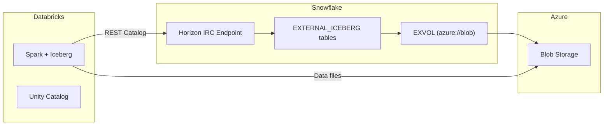

# Plan: Test Databricks Reading Snowflake Iceberg via Horizon IRC

## Problem Statement
Snowflake EXVOL uses `azure://...blob.core.windows.net` (blob endpoint) while Databricks expects `abfss://...dfs.core.windows.net` (ADLS Gen2 dfs endpoint). Need to test if Databricks can read Snowflake's Iceberg tables via Horizon IRC.

## Current Architecture



## Implementation Steps

### Step 1: Verify Horizon IRC Configuration
Check if EXTERNAL_ICEBERG tables have catalog sync enabled for IRC exposure:
```sql
SHOW ICEBERG TABLES IN ICEBERG_POC.EXTERNAL_ICEBERG;
-- Check catalog_sync_name column
```

If not configured, enable catalog sync:
```sql
ALTER ICEBERG TABLE ICEBERG_POC.EXTERNAL_ICEBERG.CUSTOMERS 
SET CATALOG_SYNC = 'IRC_SYNC_NAME';
```

### Step 2: Create Databricks Test Notebook
Add PySpark code to [poc_notebooks/08_Databricks_IRC_Interop.ipynb](poc_notebooks/08_Databricks_IRC_Interop.ipynb) that reads from Snowflake Horizon IRC:

```python
# Databricks notebook cell
spark.conf.set("spark.sql.catalog.snowflake_irc", "org.apache.iceberg.spark.SparkCatalog")
spark.conf.set("spark.sql.catalog.snowflake_irc.type", "rest")
spark.conf.set("spark.sql.catalog.snowflake_irc.uri", 
    "https://sfsenorthamerica-demo_gfuribondo2.snowflakecomputing.com/polaris/api/catalog")
spark.conf.set("spark.sql.catalog.snowflake_irc.credential", "<PAT_TOKEN>")
spark.conf.set("spark.sql.catalog.snowflake_irc.warehouse", "ICEBERG_POC")

# Test reading Snowflake Iceberg table
df = spark.read.table("snowflake_irc.EXTERNAL_ICEBERG.CUSTOMERS")
df.show()
```

### Step 3: Test Endpoint Resolution
Test scenarios:
1. **Direct read via IRC** - Does Spark resolve `azure://` paths?
2. **Credential vending** - Are vended credentials compatible with blob endpoint?
3. **Path translation** - If `azure://` fails, test if path can be translated to `abfss://`

### Step 4: Update Notebook with Findings
Add test results to notebook section documenting:
- Which endpoint format works
- Any required configuration changes
- Performance comparison if both work

## Files to Modify
- [poc_notebooks/08_Databricks_IRC_Interop.ipynb](poc_notebooks/08_Databricks_IRC_Interop.ipynb) - Add Horizon IRC test cells

## Expected Outcome
- Validated bidirectional Iceberg interop (SF->DBX via CLD, DBX->SF via IRC)
- Documented endpoint compatibility (blob vs abfss)
- Working PySpark code for Horizon IRC access
