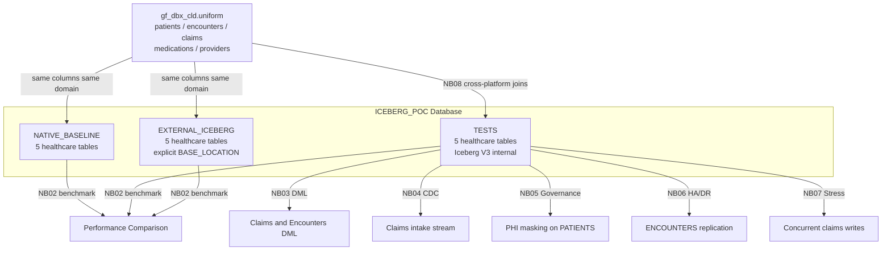

# Plan: Migrate POC Notebooks to Healthcare Data Domain

## Naming Convention

**No double-quoted identifiers anywhere.** All table names, column names, schema names, policy names, and tag names use unquoted uppercase identifiers. Snowflake stores unquoted identifiers as uppercase and resolves them case-insensitively at query time.

Example:
```sql
-- correct
CREATE ICEBERG TABLE ICEBERG_POC.TESTS.PATIENTS (patient_id NUMBER, first_name VARCHAR, ...)

-- never
CREATE ICEBERG TABLE "ICEBERG_POC"."TESTS"."PATIENTS" ("patient_id" NUMBER, ...)
```

---

## Source of Truth: gf_dbx_cld.uniform

| Table | Key Columns | CLD Rows | POC Scale |
|---|---|---|---|
| patients | patient_id, first_name, last_name, date_of_birth, gender, blood_type, primary_phone, city, state, insurance_plan | 8 | 100K |
| encounters | encounter_id, patient_id, provider_id, encounter_date, encounter_type, primary_diagnosis_code, primary_diagnosis_desc, disposition, total_charge | 10 | 500K |
| claims | claim_id, encounter_id, patient_id, payer_name, claim_status, submitted_date, paid_date, billed_amount, allowed_amount, paid_amount | 10 | 500K |
| medications | medication_id, patient_id, encounter_id, drug_name, ndc_code, dosage, frequency, prescribed_date, end_date, prescribing_provider_id | 8 | 300K |
| providers | provider_id, first_name, last_name, specialty, npi_number, facility_name, facility_city, facility_state, accepting_patients | 5 | 1K |

Column names across all Snowflake-managed tables will **exactly match** CLD column names so NB08 joins work identically on either side.

---

## Current vs. Target Table Inventory

### Current (generic)
| Schema | Tables |
|--------|--------|
| TESTS | EVENTS, DML_TEST, CDC_SOURCE, CUSTOMERS_PII, REPLICATION_TEST, CONCURRENCY_TEST, V3_VARIANT_TEST |
| NATIVE_BASELINE | same 7 |
| EXTERNAL_ICEBERG | EVENTS, CUSTOMERS, ORDERS, PRODUCTS, TRANSACTIONS |

### Target (healthcare)
| Schema | Tables | Notes |
|--------|--------|-------|
| TESTS | PATIENTS, ENCOUNTERS, CLAIMS, MEDICATIONS, PROVIDERS | Iceberg V3 internal |
| NATIVE_BASELINE | same 5 | Native Snowflake baseline |
| EXTERNAL_ICEBERG | PATIENTS, ENCOUNTERS, CLAIMS, MEDICATIONS, PROVIDERS | Explicit BASE_LOCATION |

---

## Data Flow



---

## Data Generation Pattern

All large tables use GENERATOR + SEQ4() with no double quotes:

```sql
INSERT INTO ICEBERG_POC.TESTS.PATIENTS
SELECT
    SEQ4() + 1001                                                                    AS patient_id,
    ARRAY_CONSTRUCT('Maria','James','Priya','Robert','Aisha','David','Elena','Michael')[SEQ4() % 8]::VARCHAR AS first_name,
    ARRAY_CONSTRUCT('Santos','OBrien','Patel','Chen','Johnson','Kim','Rodriguez','Thompson')[SEQ4() % 8]::VARCHAR AS last_name,
    DATEADD(day, -(SEQ4() % 36500), '1960-01-01'::DATE)                            AS date_of_birth,
    CASE SEQ4() % 2 WHEN 0 THEN 'M' ELSE 'F' END                                   AS gender,
    ARRAY_CONSTRUCT('O+','A-','B+','O+','O-','AB+')[SEQ4() % 6]::VARCHAR           AS blood_type,
    '555-' || LPAD((SEQ4() % 9999)::VARCHAR, 4, '0')                               AS primary_phone,
    ARRAY_CONSTRUCT('Phoenix','Denver','Seattle','Austin','Chicago','Portland','Miami','Boston')[SEQ4() % 8]::VARCHAR AS city,
    ARRAY_CONSTRUCT('AZ','CO','WA','TX','IL','OR','FL','MA')[SEQ4() % 8]::VARCHAR   AS state,
    ARRAY_CONSTRUCT('Blue Cross PPO','Aetna HMO','United Healthcare','Cigna EPO','Humana Gold','Medicare Advantage')[SEQ4() % 6]::VARCHAR AS insurance_plan
FROM TABLE(GENERATOR(ROWCOUNT => 100000));
```

---

## Notebook-by-Notebook Changes

### NB00 — [00_Setup_Environment.ipynb](poc_notebooks/00_Setup_Environment.ipynb)

The foundation notebook. Replaces all 7 synthetic table pairs with 5 healthcare table pairs.

**DDL changes across TESTS, NATIVE_BASELINE, EXTERNAL_ICEBERG:**

```sql
-- PATIENTS (replaces CUSTOMERS_PII + EVENTS for identity)
CREATE OR REPLACE ICEBERG TABLE ICEBERG_POC.TESTS.PATIENTS (
    patient_id      NUMBER,
    first_name      VARCHAR,
    last_name       VARCHAR,
    date_of_birth   DATE,
    gender          VARCHAR,
    blood_type      VARCHAR,
    primary_phone   VARCHAR,
    city            VARCHAR,
    state           VARCHAR,
    insurance_plan  VARCHAR
) CATALOG = SNOWFLAKE EXTERNAL_VOLUME = EXVOL ICEBERG_VERSION = 3;

-- ENCOUNTERS (replaces EVENTS as the high-volume fact table)
CREATE OR REPLACE ICEBERG TABLE ICEBERG_POC.TESTS.ENCOUNTERS (
    encounter_id            NUMBER,
    patient_id              NUMBER,
    provider_id             NUMBER,
    encounter_date          DATE,
    encounter_type          VARCHAR,
    primary_diagnosis_code  VARCHAR,
    primary_diagnosis_desc  VARCHAR,
    disposition             VARCHAR,
    total_charge            NUMBER(10,2)
) CATALOG = SNOWFLAKE EXTERNAL_VOLUME = EXVOL ICEBERG_VERSION = 3;

-- CLAIMS (replaces DML_TEST + CDC_SOURCE as the DML target)
CREATE OR REPLACE ICEBERG TABLE ICEBERG_POC.TESTS.CLAIMS (
    claim_id        NUMBER,
    encounter_id    NUMBER,
    patient_id      NUMBER,
    payer_name      VARCHAR,
    claim_status    VARCHAR,
    submitted_date  DATE,
    paid_date       DATE,
    billed_amount   NUMBER(10,2),
    allowed_amount  NUMBER(10,2),
    paid_amount     NUMBER(10,2)
) CATALOG = SNOWFLAKE EXTERNAL_VOLUME = EXVOL ICEBERG_VERSION = 3;

-- MEDICATIONS (replaces CONCURRENCY_TEST / TRANSACTIONS)
CREATE OR REPLACE ICEBERG TABLE ICEBERG_POC.TESTS.MEDICATIONS (
    medication_id           NUMBER,
    patient_id              NUMBER,
    encounter_id            NUMBER,
    drug_name               VARCHAR,
    ndc_code                VARCHAR,
    dosage                  VARCHAR,
    frequency               VARCHAR,
    prescribed_date         DATE,
    end_date                DATE,
    prescribing_provider_id NUMBER
) CATALOG = SNOWFLAKE EXTERNAL_VOLUME = EXVOL ICEBERG_VERSION = 3;

-- PROVIDERS (replaces PRODUCTS as the small reference/dimension table)
CREATE OR REPLACE ICEBERG TABLE ICEBERG_POC.TESTS.PROVIDERS (
    provider_id         NUMBER,
    first_name          VARCHAR,
    last_name           VARCHAR,
    specialty           VARCHAR,
    npi_number          VARCHAR,
    facility_name       VARCHAR,
    facility_city       VARCHAR,
    facility_state      VARCHAR,
    accepting_patients  BOOLEAN
) CATALOG = SNOWFLAKE EXTERNAL_VOLUME = EXVOL ICEBERG_VERSION = 3;
```

NATIVE_BASELINE tables use identical DDL without `CATALOG/EXTERNAL_VOLUME/ICEBERG_VERSION`.

EXTERNAL_ICEBERG tables add `BASE_LOCATION = 'external_iceberg/<table>.<hash>/'` (reusing existing path slugs from current table list).

Seed row counts for NB00 setup validation:
- PATIENTS: 10K, ENCOUNTERS: 20K, CLAIMS: 20K, MEDICATIONS: 15K, PROVIDERS: 500

---

### NB01 — [01_Iceberg_V3_Basics.ipynb](poc_notebooks/01_Iceberg_V3_Basics.ipynb)

**Remove:** V3_VARIANT_TEST with generic payload/metadata.

**Add:** PATIENT_EVENTS table with healthcare VARIANT at 1M rows:

```sql
CREATE OR REPLACE ICEBERG TABLE ICEBERG_POC.TESTS.PATIENT_EVENTS (
    event_id        NUMBER,
    patient_id      NUMBER,
    event_ts        TIMESTAMP_NTZ(9),
    event_type      VARCHAR,
    clinical_data   VARIANT,
    metadata        VARIANT
) CATALOG = SNOWFLAKE EXTERNAL_VOLUME = EXVOL ICEBERG_VERSION = 3;
```

VARIANT clinical_data payload (generated via PARSE_JSON + OBJECT_CONSTRUCT):
```json
{
  "icd10_codes": ["E11.9", "I10"],
  "vitals": {"bp_systolic": 142, "bp_diastolic": 88, "heart_rate": 74},
  "lab_results": [{"test": "HbA1c", "value": 7.8, "unit": "%"}]
}
```

VARIANT query demonstrations:
```sql
SELECT clinical_data:vitals:bp_systolic::NUMBER AS systolic,
       clinical_data:icd10_codes[0]::VARCHAR    AS primary_dx
FROM   ICEBERG_POC.TESTS.PATIENT_EVENTS
LIMIT  10;
```

---

### NB02 — [02_Performance_Benchmarks.ipynb](poc_notebooks/02_Performance_Benchmarks.ipynb)

**Remove:** All EVENTS/CUSTOMERS/ORDERS/PRODUCTS/TRANSACTIONS query references.

**Replace with 4 benchmark queries across all 3 schemas:**

```sql
-- Q1: Aggregate by encounter type (replaces GROUP BY event_type)
SELECT encounter_type, COUNT(*) AS encounter_count, AVG(total_charge) AS avg_charge
FROM   ICEBERG_POC.TESTS.ENCOUNTERS
GROUP BY encounter_type;

-- Q2: Payer claims summary (replaces TRANSACTIONS aggregate)
SELECT payer_name, COUNT(*) AS claim_count, SUM(billed_amount) AS total_billed
FROM   ICEBERG_POC.TESTS.CLAIMS
WHERE  claim_status = 'Paid'
GROUP BY payer_name;

-- Q3: Patient count by state (replaces CUSTOMERS aggregate)
SELECT state, COUNT(*) AS patient_count
FROM   ICEBERG_POC.TESTS.PATIENTS
GROUP BY state
ORDER BY patient_count DESC;

-- Q4: Provider specialty utilization (replaces PRODUCTS aggregate)
SELECT p.specialty, COUNT(e.encounter_id) AS encounter_count
FROM   ICEBERG_POC.TESTS.PROVIDERS   p
JOIN   ICEBERG_POC.TESTS.ENCOUNTERS  e ON p.provider_id = e.provider_id
GROUP BY p.specialty;
```

Each query runs against NATIVE_BASELINE, TESTS (internal Iceberg), and EXTERNAL_ICEBERG — timing and comparison logic unchanged.

---

### NB03 — [03_DML_Operations.ipynb](poc_notebooks/03_DML_Operations.ipynb)

**Remove:** DML_TEST, CUSTOMERS, ORDERS, TRANSACTIONS tables and their generic DML.

**Add healthcare DML scenarios (all on ICEBERG_POC.TESTS and EXTERNAL_ICEBERG tables):**

```sql
-- INSERT: New claim submissions
INSERT INTO ICEBERG_POC.TESTS.CLAIMS
SELECT SEQ4() + 500001 AS claim_id, ...
FROM TABLE(GENERATOR(ROWCOUNT => 50000));

-- UPDATE: Approve pending claims
UPDATE ICEBERG_POC.TESTS.CLAIMS
SET    claim_status = 'Paid', paid_date = CURRENT_DATE, paid_amount = allowed_amount * 0.8
WHERE  claim_status = 'In Review';

-- DELETE: Remove denied claims older than 90 days
DELETE FROM ICEBERG_POC.TESTS.CLAIMS
WHERE  claim_status = 'Denied'
AND    submitted_date < DATEADD(day, -90, CURRENT_DATE);

-- MERGE: Upsert new encounters from staging
MERGE INTO ICEBERG_POC.TESTS.ENCOUNTERS AS target
USING (
    SELECT SEQ4() + 1000001 AS encounter_id, SEQ4() % 100000 + 1001 AS patient_id, ...
    FROM TABLE(GENERATOR(ROWCOUNT => 50000))
    UNION ALL
    SELECT SEQ4() + 2000001 AS encounter_id, SEQ4() % 100000 + 1001 AS patient_id, ...
    FROM TABLE(GENERATOR(ROWCOUNT => 50000))
) AS src ON target.encounter_id = src.encounter_id
WHEN MATCHED     THEN UPDATE SET ...
WHEN NOT MATCHED THEN INSERT (...) VALUES (...);
```

Time travel after UPDATE:
```sql
SET before_ts = (SELECT MAX(committed_at) FROM ... -- or capture before update);
SELECT * FROM ICEBERG_POC.TESTS.CLAIMS AT(TIMESTAMP => $before_ts) LIMIT 10;
```

MERGE fix retained: use `SEQ4() + 2000001` (not a reference to a column) for the second UNION ALL block.

---

### NB04 — [04_Streams_Tasks_DynamicTables.ipynb](poc_notebooks/04_Streams_Tasks_DynamicTables.ipynb)

**Remove:** CDC_SOURCE (customer orders), CDC_STREAM, CDC_TARGET, EVENTS_SUMMARY Dynamic Table.

**Add healthcare claims intake pipeline:**

```sql
-- Stream source: incoming claims
CREATE OR REPLACE ICEBERG TABLE ICEBERG_POC.TESTS.CLAIMS_INTAKE (
    claim_id        NUMBER,
    encounter_id    NUMBER,
    patient_id      NUMBER,
    payer_name      VARCHAR,
    claim_status    VARCHAR,
    submitted_date  DATE,
    billed_amount   NUMBER(10,2)
) CATALOG = SNOWFLAKE EXTERNAL_VOLUME = EXVOL;

-- Stream (APPEND_ONLY required for Iceberg)
DROP STREAM IF EXISTS ICEBERG_POC.TESTS.CLAIMS_STREAM;
CREATE OR REPLACE STREAM ICEBERG_POC.TESTS.CLAIMS_STREAM
    ON TABLE ICEBERG_POC.TESTS.CLAIMS_INTAKE APPEND_ONLY = TRUE;

-- Target
CREATE OR REPLACE ICEBERG TABLE ICEBERG_POC.TESTS.CLAIMS_PROCESSED (
    claim_id        NUMBER,
    patient_id      NUMBER,
    payer_name      VARCHAR,
    billed_amount   NUMBER(10,2),
    change_type     VARCHAR,
    captured_at     TIMESTAMP_NTZ
) CATALOG = SNOWFLAKE EXTERNAL_VOLUME = EXVOL;

-- Task
CREATE OR REPLACE TASK ICEBERG_POC.TESTS.CLAIMS_PIPELINE_TASK
    WAREHOUSE = COMPUTE_WH SCHEDULE = '1 MINUTE'
    WHEN SYSTEM$STREAM_HAS_DATA('ICEBERG_POC.TESTS.CLAIMS_STREAM')
AS
INSERT INTO ICEBERG_POC.TESTS.CLAIMS_PROCESSED
SELECT claim_id, patient_id, payer_name, billed_amount, METADATA$ACTION, CURRENT_TIMESTAMP
FROM   ICEBERG_POC.TESTS.CLAIMS_STREAM;

-- Dynamic Table
CREATE OR REPLACE DYNAMIC TABLE ICEBERG_POC.TESTS.ENCOUNTER_SUMMARY
    TARGET_LAG = '1 minute' WAREHOUSE = COMPUTE_WH REFRESH_MODE = INCREMENTAL
AS
SELECT e.encounter_type, p.state,
       COUNT(*)              AS encounter_count,
       AVG(e.total_charge)   AS avg_charge,
       SUM(e.total_charge)   AS total_charge
FROM   ICEBERG_POC.TESTS.ENCOUNTERS e
JOIN   ICEBERG_POC.TESTS.PATIENTS   p ON e.patient_id = p.patient_id
GROUP BY e.encounter_type, p.state;
```

---

### NB05 — [05_Governance_Security.ipynb](poc_notebooks/05_Governance_Security.ipynb)

**Remove:** CUSTOMERS_PII, CUSTOMERS_PII_COPY, REGION_ACCESS, MASK_EMAIL, REGION_RAP.

**Add:** PATIENTS_PHI — healthcare-framed HIPAA PHI governance:

```sql
CREATE OR REPLACE ICEBERG TABLE ICEBERG_POC.TESTS.PATIENTS_PHI (
    patient_id      NUMBER,
    first_name      VARCHAR,
    last_name       VARCHAR,
    date_of_birth   DATE,
    ssn             VARCHAR,
    primary_phone   VARCHAR,
    state           VARCHAR,
    insurance_plan  VARCHAR
) CATALOG = SNOWFLAKE EXTERNAL_VOLUME = EXVOL;

-- Masking policies (no double quotes on names)
CREATE OR REPLACE MASKING POLICY ICEBERG_POC.TESTS.MASK_SSN
    AS (val VARCHAR) RETURNS VARCHAR ->
    CASE WHEN CURRENT_ROLE() IN ('ACCOUNTADMIN') THEN val
         ELSE '***-**-' || RIGHT(val, 4) END;

CREATE OR REPLACE MASKING POLICY ICEBERG_POC.TESTS.MASK_DOB
    AS (val DATE) RETURNS DATE ->
    CASE WHEN CURRENT_ROLE() IN ('ACCOUNTADMIN') THEN val
         ELSE '1900-01-01'::DATE END;

CREATE OR REPLACE MASKING POLICY ICEBERG_POC.TESTS.MASK_PHONE
    AS (val VARCHAR) RETURNS VARCHAR ->
    CASE WHEN CURRENT_ROLE() IN ('ACCOUNTADMIN') THEN val
         ELSE '555-***-****' END;

-- Tags
CREATE OR REPLACE TAG ICEBERG_POC.TESTS.PHI_TYPE;
CREATE OR REPLACE TAG ICEBERG_POC.TESTS.DATA_CLASSIFICATION;
CREATE OR REPLACE TAG ICEBERG_POC.TESTS.HIPAA_CATEGORY;

-- Row Access Policy (state-based, mirrors real payer regional restrictions)
CREATE OR REPLACE ROW ACCESS POLICY ICEBERG_POC.TESTS.STATE_RAP
    AS (state_col VARCHAR) RETURNS BOOLEAN ->
    CURRENT_ROLE() = 'ACCOUNTADMIN'
    OR EXISTS (
        SELECT 1 FROM ICEBERG_POC.TESTS.STATE_ACCESS
        WHERE role_name = CURRENT_ROLE() AND allowed_state = state_col
    );
```

The existing `ACCESS_HISTORY` query fix (remove `query_type` column) is applied here permanently.

---

### NB06 — [06_HA_DR_Replication.ipynb](poc_notebooks/06_HA_DR_Replication.ipynb)

**Remove:** REPLICATION_TEST (id, data, region, checksum).

**Add:** ENCOUNTERS at 1M row scale — same schema as production table, demonstrating that a realistic healthcare workload replicates cleanly:

```sql
CREATE OR REPLACE ICEBERG TABLE ICEBERG_POC.TESTS.ENCOUNTERS_DR
    CLONE ICEBERG_POC.TESTS.ENCOUNTERS;
-- or rebuild at 1M rows if CLONE not used
```

Replication metadata path verification via `SYSTEM$GET_ICEBERG_TABLE_INFORMATION` on ENCOUNTERS — logic unchanged.

---

### NB07 — [07_Concurrency_Stress.ipynb](poc_notebooks/07_Concurrency_Stress.ipynb)

**Remove:** CONCURRENCY_TEST (thread_id, operation, payload).

**Add:** CLAIMS_STRESS with healthcare VARIANT payload:

```sql
CREATE OR REPLACE ICEBERG TABLE ICEBERG_POC.TESTS.CLAIMS_STRESS (
    claim_id         NUMBER,
    patient_id       NUMBER,
    encounter_id     NUMBER,
    payer_name       VARCHAR,
    claim_status     VARCHAR,
    billed_amount    NUMBER(10,2),
    clinical_payload VARIANT,
    submitted_ts     TIMESTAMP_NTZ
) CATALOG = SNOWFLAKE EXTERNAL_VOLUME = EXVOL;
```

Concurrent write workers insert CLAIMS_STRESS rows; concurrent reads aggregate by payer. P99 latency logic unchanged.

---

### NB08 — [08_Databricks_IRC_Interop.ipynb](poc_notebooks/08_Databricks_IRC_Interop.ipynb)

**No changes.** Already uses the healthcare CLD tables. After this refactor, the Snowflake-managed tables in TESTS will share the same schema so cross-platform join comparisons become possible.

---

### NB09 — [09_POC_Results_Summary.ipynb](poc_notebooks/09_POC_Results_Summary.ipynb)

- Update infrastructure inventory queries: replace EVENTS/CUSTOMERS/ORDERS/PRODUCTS/TRANSACTIONS with PATIENTS/ENCOUNTERS/CLAIMS/MEDICATIONS/PROVIDERS
- Update CLD table row count cell table names to match
- Update SC-01 notes to reference encounter charges and claim amounts
- Update SC-02 notes to mention HIPAA PHI masking and claims CDC pipeline
- Final 6/7 PASS assessment matrix: unchanged

---

## Iceberg Constraints Preserved

| Constraint | Where Applied |
|---|---|
| `ON TABLE ... APPEND_ONLY = TRUE` (not ON ICEBERG TABLE) | NB04 CLAIMS_STREAM |
| `REFRESH_MODE = INCREMENTAL` | NB04 ENCOUNTER_SUMMARY DT |
| `AT(TIMESTAMP => $var)` for time travel | NB03 |
| `SEQ4()` not column refs inside GENERATOR | NB03 MERGE |
| No `ACCESS_HISTORY.query_type` column | NB05 audit query |
| `ICEBERG_VERSION = 3` | NB01 PATIENT_EVENTS |
| `DROP STREAM ... / CREATE STREAM` after table recreate | NB04 |
| No double-quoted object names anywhere | All notebooks |
