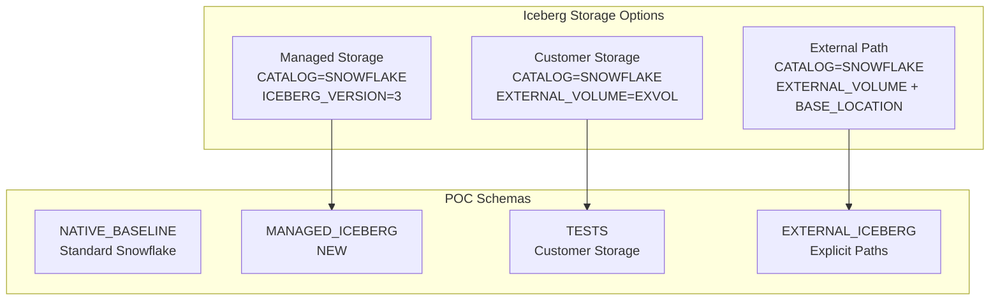

# Plan: Add Snowflake Managed Storage to Iceberg POC

## Overview

Enhance POC notebooks to compare **Managed Storage** vs **Customer-Managed Storage** for Snowflake Iceberg tables.

## Storage Types Comparison



## DDL Syntax Comparison

| Storage Type | DDL Syntax |
|--------------|------------|
| **Managed** (NEW) | `CATALOG = 'SNOWFLAKE' ICEBERG_VERSION = 3;` |
| **Customer** (Current) | `CATALOG = SNOWFLAKE EXTERNAL_VOLUME = EXVOL ICEBERG_VERSION = 3;` |
| **External Path** (Current) | `CATALOG = SNOWFLAKE EXTERNAL_VOLUME = EXVOL BASE_LOCATION = 'path/' ICEBERG_VERSION = 3;` |

## Changes Required

### 1. [poc_notebooks/00_Setup_Environment.ipynb](poc_notebooks/00_Setup_Environment.ipynb)

**Add new schema and tables after Step 1:**

```sql
-- Create schema for Managed Storage Iceberg tables
CREATE SCHEMA IF NOT EXISTS MANAGED_ICEBERG;
```

**Add new cell after Step 4 (Iceberg table creation):**

```sql
-- Create Iceberg v3 tables with MANAGED STORAGE (no external volume)
CREATE OR REPLACE ICEBERG TABLE ICEBERG_POC.MANAGED_ICEBERG.PATIENTS (
    patient_id      INT,
    first_name      VARCHAR,
    last_name       VARCHAR,
    date_of_birth   DATE,
    gender          VARCHAR,
    blood_type      VARCHAR,
    primary_phone   VARCHAR,
    city            VARCHAR,
    state           VARCHAR,
    insurance_plan  VARCHAR
)
CATALOG = 'SNOWFLAKE'
ICEBERG_VERSION = 3;

-- Similar DDL for ENCOUNTERS, CLAIMS, MEDICATIONS, PROVIDERS
-- (all 5 healthcare tables)
```

**Update verification query to include MANAGED_ICEBERG:**

```sql
SELECT table_name, type, rows FROM (
    -- ... existing rows ...
    UNION ALL SELECT 'PATIENTS', 'Managed', COUNT(*) FROM ICEBERG_POC.MANAGED_ICEBERG.PATIENTS
    -- ... for all 5 tables ...
)
```

**Update summary markdown:**
- Add MANAGED_ICEBERG to schema list
- Update table to show 4 storage types

### 2. [poc_notebooks/02_Performance_Benchmarks.ipynb](poc_notebooks/02_Performance_Benchmarks.ipynb)

**Update Test Matrix header:**

```markdown
## Table Types Under Test
| Schema | Storage | Description |
|--------|---------|-------------|
| NATIVE_BASELINE | Snowflake Native | Standard Snowflake tables |
| MANAGED_ICEBERG | Iceberg (Managed) | Iceberg v3 with Snowflake-managed storage |
| TESTS | Iceberg (Customer) | Iceberg v3 with customer external volume |
| EXTERNAL_ICEBERG | Iceberg (External Path) | Iceberg v3 with explicit BASE_LOCATION |
```

**Add 4-way comparison queries:**

```sql
-- 4-way storage comparison: Full scan benchmark
SELECT 'Native' AS storage_type, 'NATIVE_BASELINE.ENCOUNTERS' AS table_name, COUNT(*) AS row_count 
FROM ICEBERG_POC.NATIVE_BASELINE.ENCOUNTERS
UNION ALL
SELECT 'Iceberg (Managed)', 'MANAGED_ICEBERG.ENCOUNTERS', COUNT(*) 
FROM ICEBERG_POC.MANAGED_ICEBERG.ENCOUNTERS
UNION ALL
SELECT 'Iceberg (Customer)', 'TESTS.ENCOUNTERS', COUNT(*) 
FROM ICEBERG_POC.TESTS.ENCOUNTERS
UNION ALL
SELECT 'Iceberg (External)', 'EXTERNAL_ICEBERG.ENCOUNTERS', COUNT(*) 
FROM ICEBERG_POC.EXTERNAL_ICEBERG.ENCOUNTERS;
```

**Add new benchmark section:**

```markdown
## Test X: Managed vs Customer Storage Comparison
Compare Snowflake-managed storage vs customer-managed external volume.
```

### 3. Other Notebooks (as applicable)

**[poc_notebooks/03_DML_Operations.ipynb](poc_notebooks/03_DML_Operations.ipynb):**
- Add DML tests on MANAGED_ICEBERG tables
- Compare INSERT/UPDATE/DELETE performance

**[poc_notebooks/04_Streams_Tasks_DynamicTables.ipynb](poc_notebooks/04_Streams_Tasks_DynamicTables.ipynb):**
- Add streams on MANAGED_ICEBERG tables (if supported)
- Compare CDC behavior

**[poc_notebooks/05_Governance_Security.ipynb](poc_notebooks/05_Governance_Security.ipynb):**
- Verify masking policies work on managed storage
- Test row access policies on MANAGED_ICEBERG

**[poc_notebooks/07_Concurrency_Stress.ipynb](poc_notebooks/07_Concurrency_Stress.ipynb):**
- Add concurrent write tests on managed storage
- Compare locking behavior

### 4. [poc_notebooks/09_POC_Results_Summary.ipynb](poc_notebooks/09_POC_Results_Summary.ipynb)

**Add Storage Comparison Matrix:**

```markdown
## Storage Type Comparison
| Criteria | Managed Storage | Customer Storage | External Path |
|----------|-----------------|------------------|---------------|
| Setup Complexity | None | External Volume config | EV + path management |
| Storage Location | Snowflake-managed | Customer cloud account | Customer cloud + explicit paths |
| Interoperability | Horizon IRC | Horizon IRC | Horizon IRC + path visibility |
| Cost Model | Included in SF storage | Customer pays cloud storage | Customer pays cloud storage |
| Performance | Baseline | TBD% delta | TBD% delta |
```

**Add TCO Analysis Section:**

```markdown
## TCO: Managed vs Customer Storage
| Factor | Managed | Customer |
|--------|---------|----------|
| Storage Cost | SF storage rates | Cloud provider rates |
| Egress | None (internal) | Potential egress fees |
| Management | Zero | External volume maintenance |
| Portability | Via IRC | Direct cloud access |
```

## Expected Outcome

After implementation, the POC will demonstrate:

1. **4-way performance comparison**: Native vs 3 Iceberg storage options
2. **Feature parity validation**: All features work across storage types
3. **TCO guidance**: When to use managed vs customer storage
4. **Interoperability**: All storage types accessible via Horizon IRC
